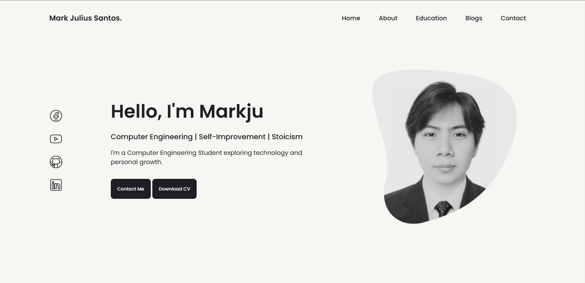
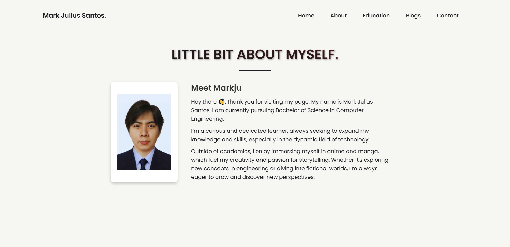
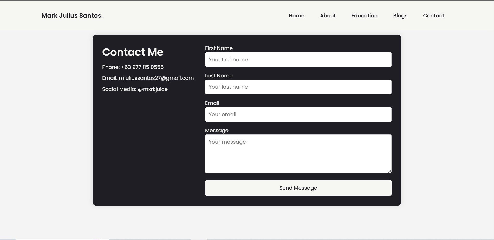

# **My Portfolio Website 🌐**  

A personal portfolio website built using **HTML, CSS, and PHP** as a school project. It features sections for my **home, about, education, blogs**, and a **contact form**.  

## **Features ✨**  
- 🏠 **Home** – Introduction and overview  
- 👤 **About** – More details about me  
- 🎓 **Education** – My academic background  
- ✍️ **Blogs** – Placeholder for future blog posts  
- 📩 **Contact Form** – Allows visitors to send messages  

## **Technologies Used 🛠️**  
- **HTML & CSS** – Structure and styling  
- **PHP** – Dynamic content and contact form functionality  

## **Screenshots 📸** 

### Home Page

### About Page

### Contact Page
